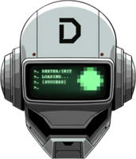

# DExteR
A Discord Extendable Robot, written using NodeJS/ESM.



## Table of Contents
- [Introduction](#introduction)
- [Installation](#installation)
- [Usage](#usage)
- [License](#license)

## Introduction
A more verbose description of the bot will go here.

## Installation
1. Clone the repository:
```bash
 git clone https://github.com/ODyckhoff/DExteR.git.git
```

2. Install dependencies:
```bash
 npm install
 ```

3. Have a cup of tea.

## Usage
With DExteR installed, simply run:
```bash
 node .
```

## License
This software is covered by the Mozilla Public License, Verion 2. A copy of this license is included in this repository: [Link to MPLv2](LICENSE)

A brief summary is that you can do whatever you like with this code, so long as it remains open source under the terms of the license. I do not have any liability for your use of the software, nor do I offer any warranty.
